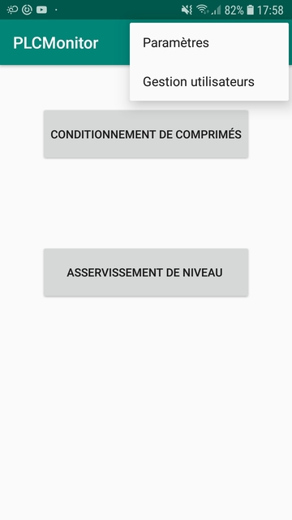
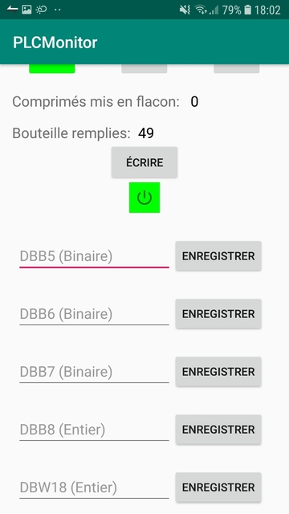
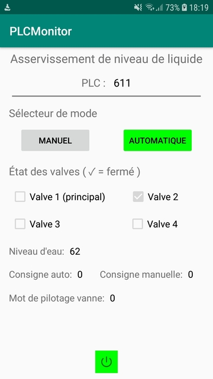
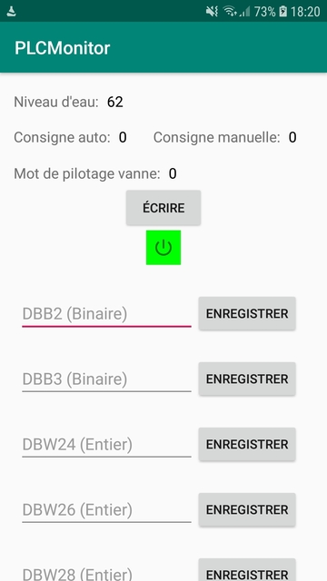
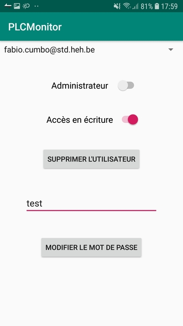

# S7-PLC-Monitor

This project was carried out as part of the mobile development course at the Haute école en Hainaut. It aims to create an application on Android to supervise and remotely control 2 industrial processes.

- Tablet packaging, controlled by the S7-1516 2DPPN PLC.
  
- Liquid level control, controlled by PLC S7-1214C.

## Features

The application is very easy to use and provides basic functionalities.

- Reading of real-time PLC values with Thread & Handler.
  
- Writing values in the PLC.
  
- User management (default administrator account) with SQLite.
  
- Access management for reading and writing in PLCs.
  
- Basic security (regex, minimum password length, access management).
  
- Settings for connection to the PLC (IP, rack, slot).

For more information about the application and software used for the PLC, you can consult the `Report.pdf` file (in .French).

## Improvements

Some interesting improvements could be made to this project to complete it.

- An additional table concerning the configuration of the PLCs in the database would be interesting. Indeed, on the one hand, this would make it possible to do not redefine the access configuration each time the application is launched to the PLC. On the other hand, it would allow the user to manage several PLCs with different configurations on the application. It would therefore also be necessary to improve the UI.

- The use of an encrypted database to guarantee a better security.

- Store only a hash of user passwords to improve
security again.

## Screenshots

 

 

 

 
